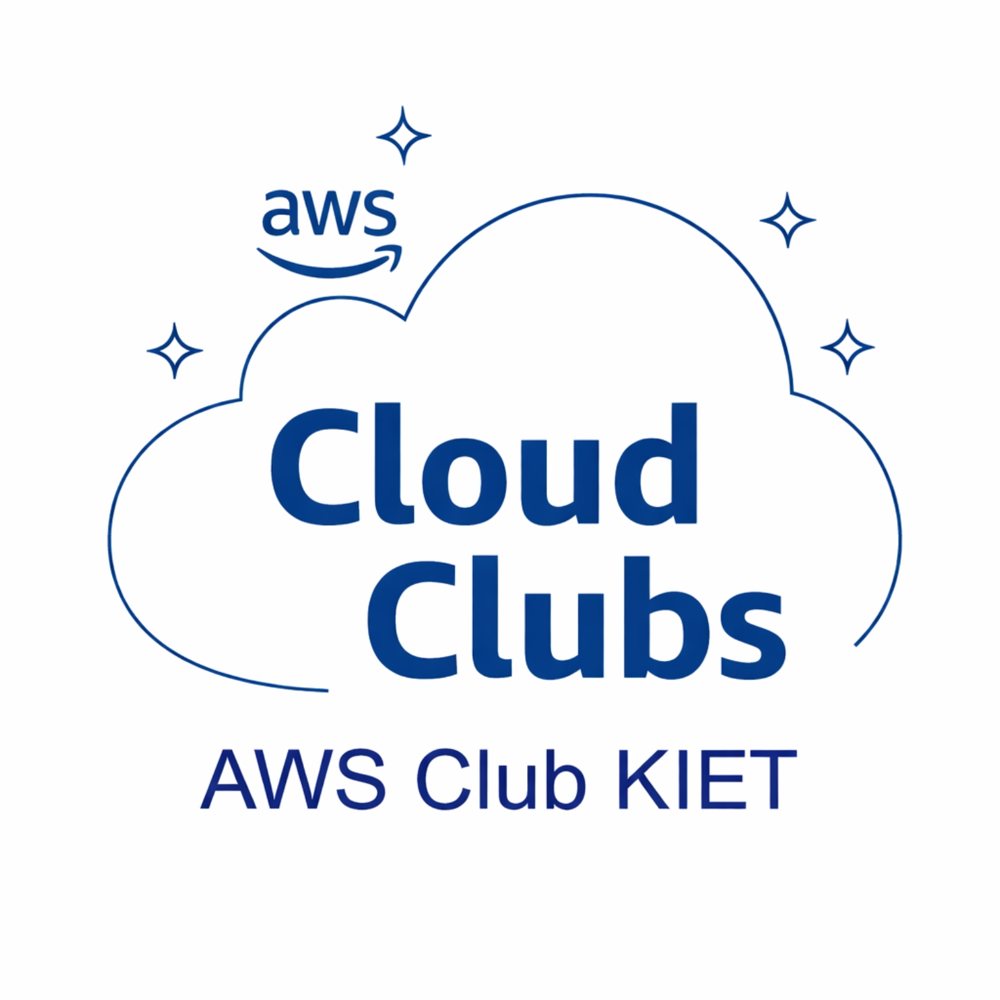

<p align="center">
  
</p>

<h1 align="center">Cloud & DevOps Hackathon – AWS</h1>

<p align="center">
  Organized by <strong>AWS Cloud Club KIET</strong><br/>
  Under the <strong>Department of Computer Science and Engineering (CSE)</strong><br/>
  Learning Cloud and DevOps through real-world implementation
</p>

---

## Index

1. [Introduction](#introduction)  
2. [Objectives of the Hackathon](#objectives-of-the-hackathon)  
3. [Target Audience and Skill Levels](#target-audience-and-skill-levels)  
4. [Hackathon Format](#hackathon-format)  
5. [Team Formation Rules](#team-formation-rules)  
6. [Repository Submission Structure](#repository-submission-structure-mandatory)  
7. [Project README Requirements](#project-readme-requirements)  
8. [Demo Video Submission](#demo-video-submission-mandatory)  
9. [Submission Process](#submission-process)  
10. [Rules and Code of Conduct](#rules-and-code-of-conduct)  
11. [Expected Learning Outcomes](#expected-learning-outcomes)  
12. [Final Organizer Statement](#final-organizer-statement)

---

## Introduction

The Cloud and DevOps Hackathon is a structured, hands-on learning event designed to introduce students to modern cloud computing and DevOps practices using Amazon Web Services (AWS).

This hackathon follows a learning-first approach. The primary goal is not competition, but to ensure that every participant gains practical experience in deploying, managing, automating, monitoring, and securing applications in cloud environments. Students are encouraged to focus on clarity, correctness, and understanding rather than project size or complexity.

---

## Objectives of the Hackathon

The objectives of this hackathon are:

- To introduce students to core cloud computing concepts  
- To explain the end-to-end DevOps lifecycle  
- To build confidence in deploying and managing applications on AWS  
- To promote hands-on learning through real-world cloud use cases  
- To encourage best practices in documentation, security, and automation  

---

## Target Audience and Skill Levels

This hackathon is designed for students with different levels of technical experience.

### Beginner Level
Students who are new to cloud computing and DevOps concepts and have little or no experience with AWS deployments.

### Intermediate Level
Students with prior exposure to application deployment, Docker, or basic automation tools.

Each team must submit one project from the Beginner level and one project from the Intermediate level.

---

## Hackathon Format

- Type: Guided Mini Hackathon  
- Duration: 6 to 8 hours  
- Theme: Cloud and DevOps using Amazon Web Services  

Mentors will be available throughout the event to guide participants conceptually. Mentors will not write, configure, or deploy solutions on behalf of the teams.

---

## Team Formation Rules

- Each team must consist of 4 to 5 members  
- Each team must form a single submission unit  
- Cross-year and mixed-experience teams are encouraged  
- Each team must submit exactly two projects:  
  - One Beginner project  
  - One Intermediate project  

---

## Repository Submission Structure (Mandatory)

Each team must create a single folder using their team name as shown below.

```

Team-YourTeamName/
├── beginner/
│   └── beginner-project-name/
│       ├── README.md
│       ├── architecture.png
│       └── src/
│
└── intermediate/
      └── intermediate-project-name/
      ├── README.md
      ├── architecture.png
      └── src/

```

Submissions that do not strictly follow this structure will not be evaluated.

---

## Project README Requirements

Each project, both Beginner and Intermediate, must contain a detailed README.md file with the following sections:

- Problem Statement  
- Architecture Overview  
- AWS Services Used  
- Deployment Steps  
- Security Considerations  
- Challenges Faced  
- Key Learnings  
- Screenshots (optional)  
- Demo Video Link (mandatory)  

---

## Demo Video Submission (Mandatory)

Each project must include a recorded demo video with a duration of 5 to 8 minutes.

The video must be uploaded to YouTube and can be either Public or Unlisted.

The demo video must cover:
- Problem explanation  
- Architecture walkthrough  
- AWS services used  
- Application deployment or execution  
- Observations and learnings  

The YouTube video link must be added inside the project README.md file.

Projects submitted without a demo video link will receive heavy penalties or may be rejected.

---

## Submission Process

1. Fork this repository to your GitHub account  
2. Create a folder using your team name  
3. Add both Beginner and Intermediate projects following the defined structure  
4. Ensure all documentation and video links are present  
5. Raise a single Pull Request for evaluation  

Multiple pull requests from the same team are not allowed.

---

## Rules and Code of Conduct

- Plagiarism is strictly prohibited  
- Pre-built or copied projects are not allowed  
- Mentors may guide conceptually but must not implement solutions  
- All participants are expected to follow ethical and respectful collaboration practices  

---

## Expected Learning Outcomes

By the end of the hackathon, participants will be able to:

- Understand AWS core services and cloud fundamentals  
- Deploy real-world applications on cloud infrastructure  
- Apply DevOps principles and automation workflows  
- Design and explain cloud architectures confidently  
- Document projects in a professional and structured manner  

---

## Final Organizer Statement

“This hackathon is about learning Cloud and DevOps by doing, not about building the biggest project.”

Team AWS Cloud Club KIET


